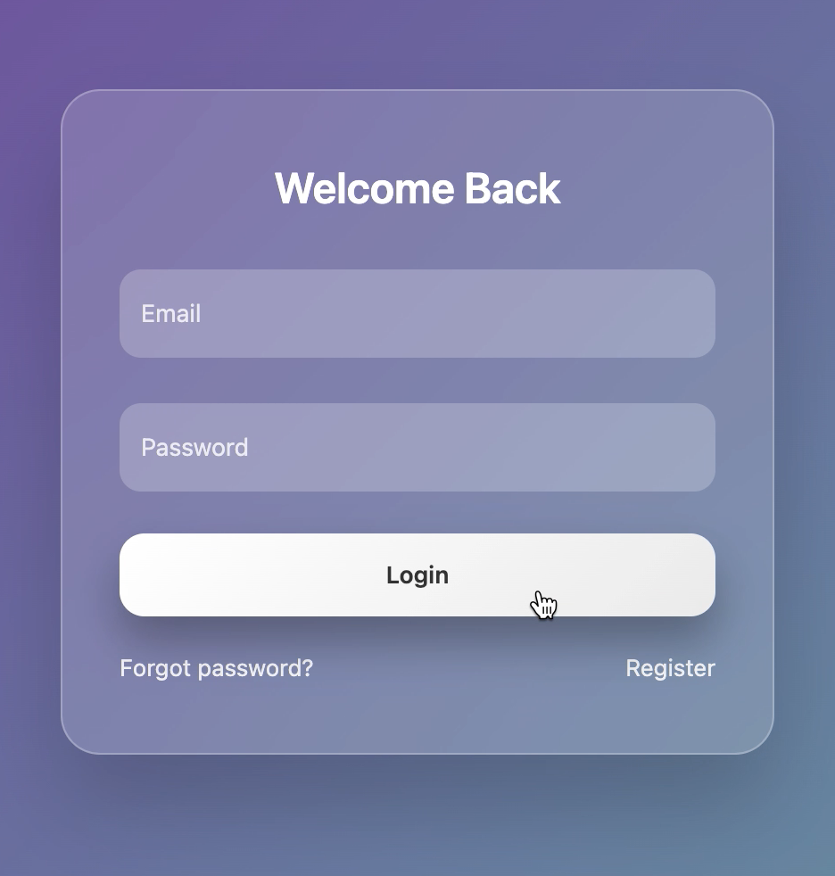
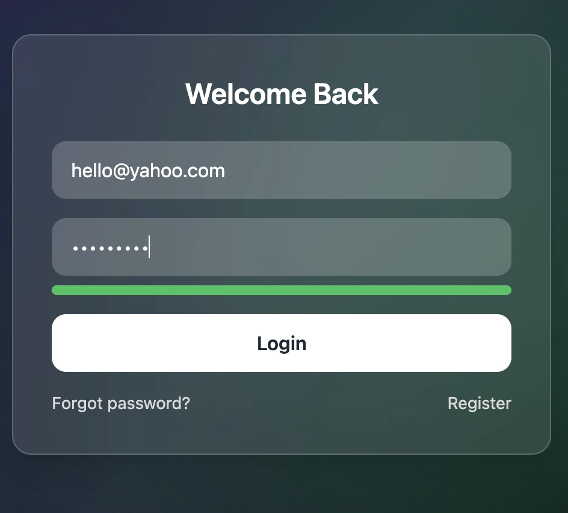
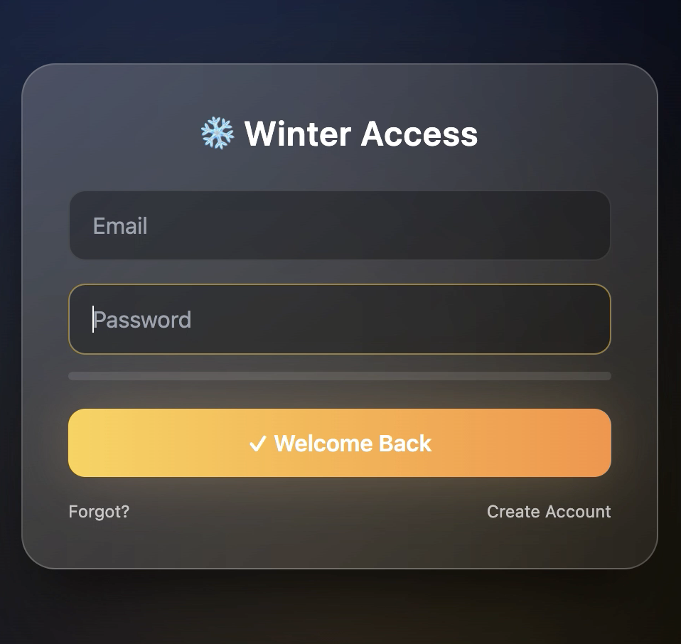
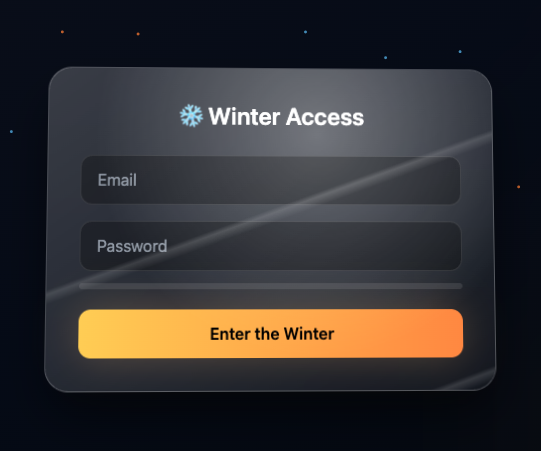

# Awesome UI Auth HTML Pack

Modern, clean, and elegant authentication UI components built with **pure HTML, CSS (or Tailwind CSS), and minimal JavaScript**.

This pack is designed to help developers and designers quickly implement beautiful authentication flows for modern web applications.

---

## ✨ Features

- Modern and elegant UI design
- Built with pure HTML, CSS, and minimal JavaScript
- No heavy frameworks required
- Fully responsive (mobile & desktop)
- Clean and easy-to-understand code structure
- Smooth animations and micro-interactions
- Easy to customize and extend

---

## 📦 Included Components

- Glassmorphism Login Form  
- Flip Login / Register Card (CSS 3D animation)  
- Password Strength Indicator  
- OTP Verification UI (6-digit input)  
- Forgot Password Multi-Step Flow  

---

## 🛠 Tech Stack

- HTML5
- CSS3 / Tailwind CSS
- Vanilla JavaScript (minimal usage)


## 🚀 Getting Started

```bash
git clone  https://github.com/arjalikastudio/awesome-auth-html.git
cd awesome-auth-html
open index.html inside folder
```


---
## 📸 Screenshots Preview

<table>
  <tr>
    <td align="center">
      <br/>
      <sub>Preview 1</sub>
    </td>
    <td align="center">
      <br/>
      <sub>Preview 2</sub>
    </td>
  </tr>
  <tr>
    <td align="center">
      <br/>
      <sub>Preview 3</sub>
    </td>
    <td align="center">
      <br/>
      <sub>Preview 4</sub>
    </td>
  </tr>
   
</table>


